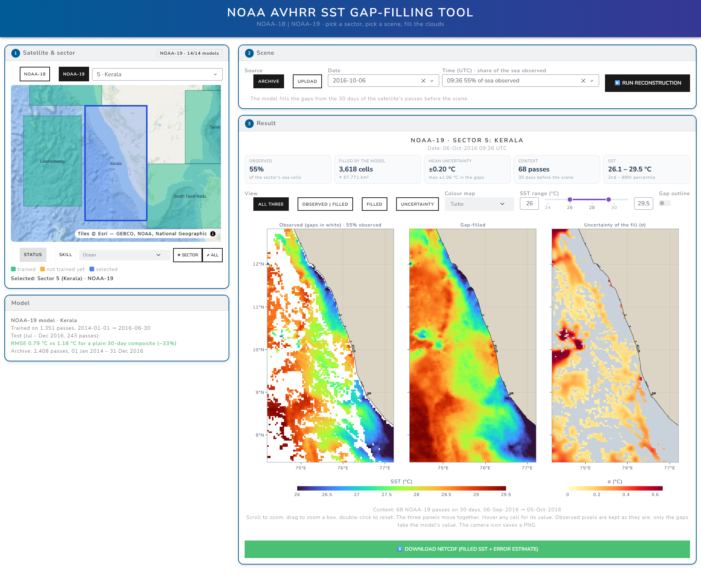

# novagapgan — NOAA-18 / NOAA-19 SST gap filling

Fills the cloud gaps in NOAA-18 and NOAA-19 AVHRR sea-surface temperature (SST)
images for 14 coastal sectors around India. It is a local web app with 28 trained
models (one per satellite and sector) and the 2014–2016 archives they use as
context, so it runs out of the box.



## Get it

```bash
git clone https://github.com/krishnathota112/novagapgan.git
```

or **Code → Download ZIP** on this page (≈0.9 GB, mostly models and archives).

## Set up and run

Step-by-step instructions are in **[START_HERE.md](START_HERE.md)**. In short, with
Python 3.11+ installed:

| | once | every time |
|---|---|---|
| Windows | `setup_windows.bat` | `run_noaa_app.bat` |
| macOS / Linux | `bash setup_mac_linux.sh` | `bash run_noaa_app.sh` |

The app opens at <http://localhost:8052>. An NVIDIA GPU is used when present; the
CPU works too.

## Results

Error of the filled pixels on Jul–Dec 2016, a period never used in training,
averaged over the 28 models: **0.67 °C**, against 1.32 °C for filling with the
average of the previous 30 days. Per model: [epochs200_report.md](epochs200_report.md).

## More

[README_NOAA.md](README_NOAA.md) describes the data split, the inputs the model
sees, the network, and how to retrain (retraining also needs the raw NOAA swath
zips, which are not in this repository).
